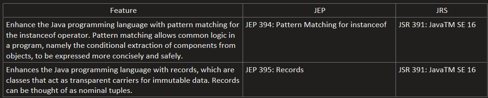
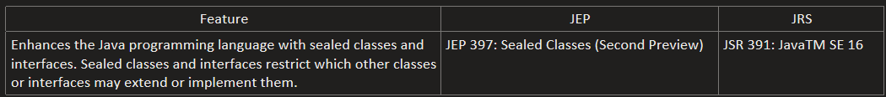
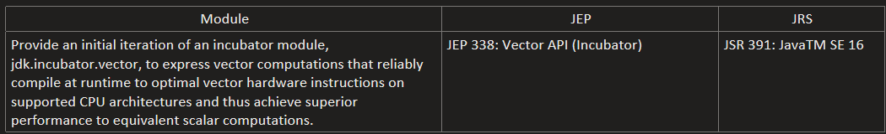
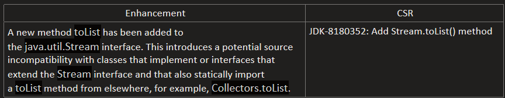

# java-16-features
## New Features:

## New Preview Features:

## New Incubator modules:

## New Enhancements:

## Settings in IntelliJ IDEA to use "Preview" features with Java 16
#### Settings > Build, Execution, Deployment > Compiler > Java Compiler :
- #### Project bytecode version: 16
- #### Per-module bytecode version:
    - #### Module: java-16-features
    - #### Target bytecode version: 16
- #### Javac Options:
    - #### Additional command line parameters: --enable-preview
#### Run/Debug Configurations > Application > [Choose Application] :
- #### Build and Run > Modify Options > Add VM Options :
    - #### VM Options: --enable-preview
## Settings in IntelliJ IDEA to use "Incubator" modules with Java 16
#### Settings > Build, Execution, Deployment > Compiler > Java Compiler :
- #### Project bytecode version: 16
- #### Per-module bytecode version:
    - #### Module: java-16-features
    - #### Target bytecode version: 16
- #### Javac Options:
    - #### Additional command line parameters: --add-modules [Module Package]
      #### example: --add-modules jdk.incubator.vector
#### Run/Debug Configurations > Application > [Choose Application] :
- #### Build and Run > Modify Options > Add VM Options :
    - #### VM Options: --add-modules [Module Package]
      #### example: --add-modules jdk.incubator.vector